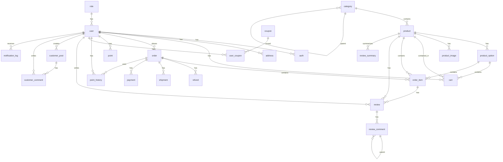
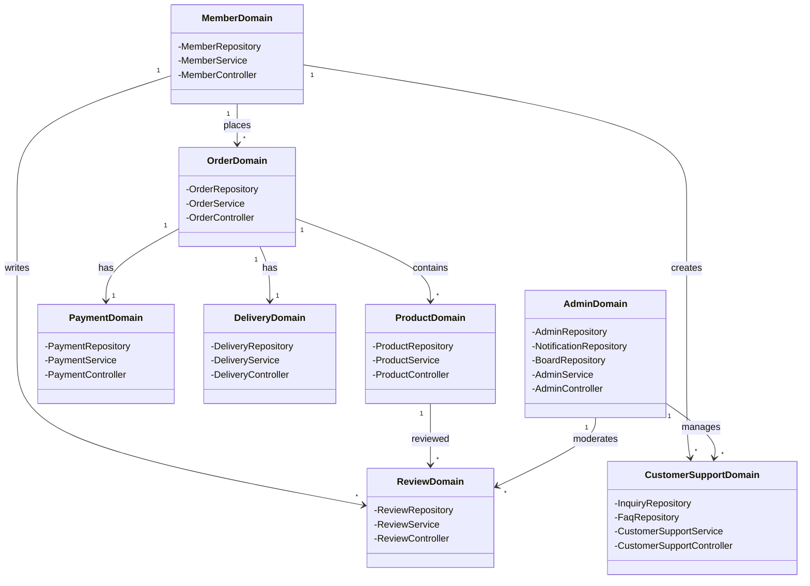
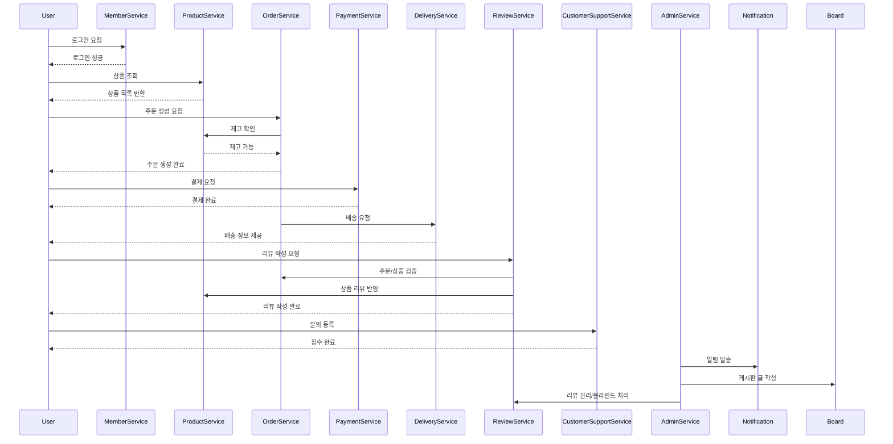

# ADR: 이커머스 프로그램 도메인 설계

## 작성일
2025-09-03

---

## 컨텍스트
본 시스템은 **이커머스 플랫폼**으로, 사용자에게 상품 탐색, 주문, 결제, 배송 추적 및 고객 지원 서비스를 제공하며,  
관리자에게는 상품/재고/회원 관리와 알림/게시판 관리 기능을 제공합니다.

향후 확장성과 유지보수를 고려하여 **도메인 주도 설계(DDD)** 방식을 적용하며, 각 기능은 명확히 분리된 도메인으로 관리됩니다.

- 각 도메인은 Aggregate Root 중심으로 설계
- 핵심 비즈니스 규칙을 Domain Service로 구현
- 데이터 변경 이력을 추적할 수 있도록 created_at, updated_at 컬럼 포함
---

## 결정
- 도메인 구분:
    - **MemberDomain**: 회원, 인증, 주소, 포인트, 쿠폰
    - **ProductDomain**: 상품, 카테고리, 옵션, 이미지, 리뷰
    - **OrderDomain**: 장바구니, 주문, 주문항목, 환불, 배송
    - **PaymentDomain**: 결제, 결제 상태, 트랜잭션
    - **DeliveryDomain**: 배송 상태, 운송장
    - **CustomerSupportDomain**: 고객센터 게시글, 댓글, 문의 처리
    - **AdminDomain**: 배너, 공지, 알림, 관리자 권한

- 각 도메인은 독립적으로 발전 가능하며, 마이크로서비스 전환 가능
- 상태 관리는 코드 테이블 기반으로 유연하게 처리
- ERD와 클래스 다이어그램으로 데이터와 객체 구조 명확화
- 시퀀스 다이어그램으로 사용자 플로우와 관리 기능 정의

---

## 근거
- 도메인 세분화로 서비스 확장성과 유지보수성 향상
- 독립적 배포 및 운영 가능
- 이커머스 핵심 기능(회원가입, 상품조회, 장바구니, 주문, 결제, 배송, 고객지원)을 각각의 Aggregate Root로 정의
- Domain Service 및 Repository 패턴으로 비즈니스 규칙을 명확히 구현

---

## 다이어그램

### 1. DB 스키마 (PostgreSQL 기준)
```postgresql
-- 3.1 테이블 생성
CREATE TABLE role (
    role_id     BIGSERIAL PRIMARY KEY,
    role_name   VARCHAR(50) NOT NULL,
    created_at  TIMESTAMPTZ NOT NULL DEFAULT now(),
    updated_at  TIMESTAMPTZ NOT NULL DEFAULT now()
);

CREATE TABLE "user" (
    user_id BIGSERIAL PRIMARY KEY,
    email VARCHAR(255) UNIQUE NOT NULL,
    password VARCHAR(255) NOT NULL,
    name VARCHAR(100) NOT NULL,
    phone VARCHAR(20),
    role_id BIGINT REFERENCES role(role_id),
    created_at TIMESTAMPTZ NOT NULL DEFAULT now(),
    updated_at TIMESTAMPTZ NOT NULL DEFAULT now(),
    deleted_at TIMESTAMPTZ
);

CREATE TABLE auth (
    auth_token     VARCHAR(255) PRIMARY KEY,
    refresh_token  VARCHAR(255),
    user_id        BIGINT REFERENCES "user"(user_id),
    expires_at     TIMESTAMPTZ,
    created_at     TIMESTAMPTZ NOT NULL DEFAULT now(),
    updated_at     TIMESTAMPTZ NOT NULL DEFAULT now()
);

CREATE TABLE address (
    address_id       BIGSERIAL PRIMARY KEY,
    user_id          BIGINT REFERENCES "user"(user_id),
    recipient_name   VARCHAR(100),
    recipient_phone  VARCHAR(20),
    zipcode          VARCHAR(20),
    detail_address   TEXT,
    is_default       BOOLEAN DEFAULT false,
    created_at       TIMESTAMPTZ NOT NULL DEFAULT now(),
    updated_at       TIMESTAMPTZ NOT NULL DEFAULT now()
);

-- 3.2 상품 도메인
CREATE TABLE category (
    category_id      BIGSERIAL PRIMARY KEY,
    name             VARCHAR(100) NOT NULL,
    parent_category  BIGINT REFERENCES category(category_id),
    created_at       TIMESTAMPTZ NOT NULL DEFAULT now(),
    updated_at       TIMESTAMPTZ NOT NULL DEFAULT now()
);

CREATE TABLE product (
    product_id   BIGSERIAL PRIMARY KEY,
    name         VARCHAR(200) NOT NULL,
    description  TEXT,
    brand        VARCHAR(100),
    category_id  BIGINT REFERENCES category(category_id),
    price        NUMERIC(12,2) NOT NULL,
    status       VARCHAR(50) NOT NULL,
    created_at   TIMESTAMPTZ NOT NULL DEFAULT now(),
    updated_at   TIMESTAMPTZ NOT NULL DEFAULT now()
);

CREATE TABLE product_option (
    option_id        BIGSERIAL PRIMARY KEY,
    product_id       BIGINT REFERENCES product(product_id),
    attributes       JSONB,
    additional_price NUMERIC(12,2) DEFAULT 0,
    stock            INT NOT NULL,
    created_at       TIMESTAMPTZ NOT NULL DEFAULT now(),
    updated_at       TIMESTAMPTZ NOT NULL DEFAULT now()
);

CREATE TABLE product_image (
    image_id    BIGSERIAL PRIMARY KEY,
    product_id  BIGINT REFERENCES product(product_id),
    url         TEXT NOT NULL,
    is_main     BOOLEAN DEFAULT false,
    sort_order  INT DEFAULT 0,
    created_at  TIMESTAMPTZ NOT NULL DEFAULT now(),
    updated_at  TIMESTAMPTZ NOT NULL DEFAULT now()
);

-- 3.3 주문 도메인
CREATE TABLE cart (
    cart_id     BIGSERIAL PRIMARY KEY,
    user_id     BIGINT REFERENCES "user"(user_id),
    product_id  BIGINT REFERENCES product(product_id),
    option_id   BIGINT REFERENCES product_option(option_id),
    quantity    INT NOT NULL,
    price       NUMERIC(12,2) NOT NULL,
    created_at  TIMESTAMPTZ NOT NULL DEFAULT now(),
    updated_at  TIMESTAMPTZ NOT NULL DEFAULT now()
);

CREATE TABLE "order" (
    order_id        BIGSERIAL PRIMARY KEY,
    user_id         BIGINT REFERENCES "user"(user_id),
    recipient_name  VARCHAR(100),
    recipient_phone VARCHAR(20),
    zipcode         VARCHAR(20),
    detail_address  TEXT,
    payment_method  VARCHAR(50),
    total_amount    NUMERIC(12,2) NOT NULL,
    status          VARCHAR(50) NOT NULL,
    created_at      TIMESTAMPTZ NOT NULL DEFAULT now(),
    updated_at      TIMESTAMPTZ NOT NULL DEFAULT now()
);

CREATE TABLE order_item (
    order_item_id   BIGSERIAL PRIMARY KEY,
    order_id        BIGINT REFERENCES "order"(order_id),
    product_id      BIGINT REFERENCES product(product_id),
    option_id       BIGINT REFERENCES product_option(option_id),
    option_snapshot JSONB,
    quantity        INT NOT NULL,
    unit_price      NUMERIC(12,2) NOT NULL,
    created_at      TIMESTAMPTZ NOT NULL DEFAULT now(),
    updated_at      TIMESTAMPTZ NOT NULL DEFAULT now()
);

CREATE TABLE refund (
    refund_id    BIGSERIAL PRIMARY KEY,
    order_id     BIGINT REFERENCES "order"(order_id),
    amount       NUMERIC(12,2) NOT NULL,
    status       VARCHAR(50),
    reason       TEXT,
    processed_at TIMESTAMPTZ,
    created_at   TIMESTAMPTZ NOT NULL DEFAULT now(),
    updated_at   TIMESTAMPTZ NOT NULL DEFAULT now()
);

CREATE TABLE shipment (
    shipment_id     BIGSERIAL PRIMARY KEY,
    order_id        BIGINT REFERENCES "order"(order_id),
    carrier         VARCHAR(100),
    tracking_number VARCHAR(100),
    status          VARCHAR(50),
    created_at      TIMESTAMPTZ NOT NULL DEFAULT now(),
    updated_at      TIMESTAMPTZ NOT NULL DEFAULT now()
);

-- 3.4 결제 도메인
CREATE TABLE payment (
    payment_id     BIGSERIAL PRIMARY KEY,
    order_id       BIGINT REFERENCES "order"(order_id),
    amount         NUMERIC(12,2) NOT NULL,
    method         VARCHAR(50),
    status         VARCHAR(50),
    transaction_id VARCHAR(255),
    error_message  TEXT,
    created_at     TIMESTAMPTZ NOT NULL DEFAULT now(),
    updated_at     TIMESTAMPTZ NOT NULL DEFAULT now()
);

CREATE TABLE point (
    user_id      BIGINT PRIMARY KEY REFERENCES "user"(user_id),
    point_balance INT DEFAULT 0,
    created_at   TIMESTAMPTZ NOT NULL DEFAULT now(),
    updated_at   TIMESTAMPTZ NOT NULL DEFAULT now()
);

CREATE TABLE point_history (
    point_history_id BIGSERIAL PRIMARY KEY,
    user_id          BIGINT REFERENCES "user"(user_id),
    order_id         BIGINT REFERENCES "order"(order_id),
    type             VARCHAR(50),
    amount           INT NOT NULL,
    created_at       TIMESTAMPTZ NOT NULL DEFAULT now(),
    updated_at       TIMESTAMPTZ NOT NULL DEFAULT now()
);

CREATE TABLE coupon (
    coupon_id       BIGSERIAL PRIMARY KEY,
    discount_amount NUMERIC(12,2) NOT NULL,
    min_order_price NUMERIC(12,2),
    valid_until     TIMESTAMPTZ,
    created_at      TIMESTAMPTZ NOT NULL DEFAULT now(),
    updated_at      TIMESTAMPTZ NOT NULL DEFAULT now()
);

CREATE TABLE user_coupon (
    user_coupon_id BIGSERIAL PRIMARY KEY,
    user_id        BIGINT REFERENCES "user"(user_id),
    coupon_id      BIGINT REFERENCES coupon(coupon_id),
    status         VARCHAR(50),
    issued_at      TIMESTAMPTZ,
    used_at        TIMESTAMPTZ,
    created_at     TIMESTAMPTZ NOT NULL DEFAULT now(),
    updated_at     TIMESTAMPTZ NOT NULL DEFAULT now()
);

-- 3.5 리뷰 도메인
CREATE TABLE review (
    review_id   BIGSERIAL PRIMARY KEY,
    order_item_id BIGINT REFERENCES order_item(order_item_id),
    user_id     BIGINT REFERENCES "user"(user_id),
    product_id  BIGINT REFERENCES product(product_id),
    rating      INT CHECK(rating BETWEEN 1 AND 5),
    content     TEXT,
    image_url   TEXT,
    created_at  TIMESTAMPTZ NOT NULL DEFAULT now(),
    updated_at  TIMESTAMPTZ NOT NULL DEFAULT now()
);

CREATE TABLE review_summary (
    product_id   BIGINT PRIMARY KEY REFERENCES product(product_id),
    avg_rating   NUMERIC(3,2),
    review_count INT,
    created_at   TIMESTAMPTZ NOT NULL DEFAULT now(),
    updated_at   TIMESTAMPTZ NOT NULL DEFAULT now()
);

CREATE TABLE review_comment (
    comment_id        BIGSERIAL PRIMARY KEY,
    review_id         BIGINT REFERENCES review(review_id),
    user_id           BIGINT REFERENCES "user"(user_id),
    content           TEXT,
    parent_comment_id BIGINT REFERENCES review_comment(comment_id),
    created_at        TIMESTAMPTZ NOT NULL DEFAULT now(),
    updated_at        TIMESTAMPTZ NOT NULL DEFAULT now()
);

-- 3.6 고객센터 도메인
CREATE TABLE customer_post (
    post_id           BIGSERIAL PRIMARY KEY,
    user_id           BIGINT REFERENCES "user"(user_id),
    title             VARCHAR(200),
    content           TEXT,
    image_url         TEXT,
    category          VARCHAR(100),
    status            VARCHAR(50),
    assigned_admin_id BIGINT REFERENCES "user"(user_id),
    created_at        TIMESTAMPTZ NOT NULL DEFAULT now(),
    updated_at        TIMESTAMPTZ NOT NULL DEFAULT now()
);

CREATE TABLE customer_comment (
    comment_id BIGSERIAL PRIMARY KEY,
    post_id    BIGINT REFERENCES customer_post(post_id),
    user_id    BIGINT REFERENCES "user"(user_id),
    content    TEXT,
    is_read    BOOLEAN DEFAULT false,
    created_at TIMESTAMPTZ NOT NULL DEFAULT now(),
    updated_at TIMESTAMPTZ NOT NULL DEFAULT now()
);

CREATE TABLE notice (
    notice_id  BIGSERIAL PRIMARY KEY,
    title      VARCHAR(200),
    content    TEXT,
    created_at TIMESTAMPTZ NOT NULL DEFAULT now(),
    updated_at TIMESTAMPTZ NOT NULL DEFAULT now()
);

-- 3.7 관리자 도메인
CREATE TABLE banner (
    banner_id   BIGSERIAL PRIMARY KEY,
    image_url   TEXT NOT NULL,
    score       INT DEFAULT 0,
    priority    INT DEFAULT 0,
    redirect_url TEXT,
    start_date  TIMESTAMPTZ,
    end_date    TIMESTAMPTZ,
    created_at  TIMESTAMPTZ NOT NULL DEFAULT now(),
    updated_at  TIMESTAMPTZ NOT NULL DEFAULT now()
);

CREATE TABLE notification_log (
    notification_id BIGSERIAL PRIMARY KEY,
    user_id         BIGINT REFERENCES "user"(user_id),
    type            VARCHAR(50),
    message         TEXT,
    status          VARCHAR(50),
    error_message   TEXT,
    created_at      TIMESTAMPTZ NOT NULL DEFAULT now()
);

```
### 2. ERD (데이터베이스 개념 모델)


### 3. 도메인 클래스 다이어그램


### 4.시퀀스 다이어그램 (상품 주문 및 고객지원 흐름)


---
## 결과
- 회원, 상품, 주문, 결제, 배송, 리뷰, 고객지원, 관리자(Admin) 도메인으로 분리
- 각 도메인은 독립적인 책임을 가짐
- ERD와 클래스 다이어그램을 통해 데이터와 객체 구조 명확화
- 시퀀스 다이어그램으로 사용자 플로우와 관리 기능까지 정의

---
## 대안
| 대안 | 장점 | 단점 | 채택 여부 |
|------|------|------|-----------|
| **단일 모놀리식 설계** | 구현이 단순하고 빠르며, 초기 런칭 시 개발 속도가 빠름 | 기능이 복잡해질수록 코드 의존성이 증가, 변경 시 리스크 큼, 확장성 부족 | X |
| **마이크로서비스 아키텍처(MSA) 즉시 도입** | 서비스 간 완전한 분리, 독립 배포/확장 가능, 클라우드 친화적 | 초기 설계 및 운영 복잡성, 팀 리소스 부족 시 과도한 오버엔지니어링 | X |
| **도메인 구분 없는 단일 DB 스키마** | 데이터 모델이 단순, 쿼리 작성 용이 | 도메인 간 결합도가 높아지고 유지보수 어려움, 변경 시 전체 영향 발생 | X |
| **DDD 기반 도메인 분리 (선택)** | 도메인별 관심사 분리, 유지보수성과 확장성 향상, 향후 MSA 전환 용이 | 초기 설계에 시간과 리소스 필요, 학습 곡선 존재 | O |
| **ENUM 기반 상태 관리** | 구현 단순, 코드 가독성 높음 | 상태 값 변경 시 배포 필요, 다국어/유연성 부족 | X |
| **코드 테이블 기반 상태 관리 (선택)** | DB에서 동적으로 관리 가능, 다국어 확장 및 추가 상태 처리 용이 | 쿼리 복잡도 증가, 성능 최적화 필요 | O |

---

## 관련 문서(선택사항)

---

## 참고자료(선택사항)

---

## 담당자

- 작성자: 김동욱

- 검토자: 


