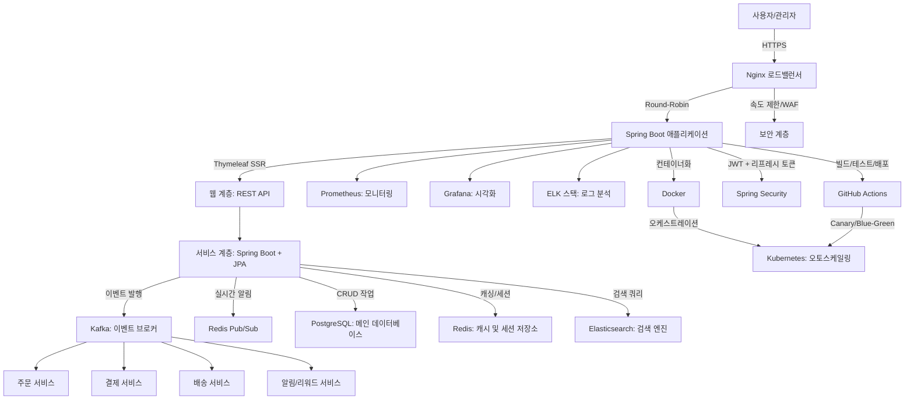

# ADR: E-Commerce 프로젝트 기술·아키텍처 결정_V01

## 작성일
2025-09-22

---

## 1. 컨텍스트

본 시스템은 일반 웹 서버 플랫폼으로, 사용자에게 상품 탐색, 주문, 결제, 배송 추적 및 관리 기능을 제공하며,  
관리자는 시스템 모니터링, 사용자 관리 및 로그 분석을 수행합니다.

- **DAU(Daily Active Users): 초기 10,000명**
    - 이커머스 신규 서비스 초창기 트래픽 수준.
    - 초당 약 100 요청 처리 가정.
    - 단일 모놀리식 아키텍처에서도 충분히 처리 가능한 수준.
    - 과도한 초기 복잡도(완전 MSA, Event Sourcing 등) 없이 비용/성능 균형 가능.
    - 향후 DAU 증가 시 자연스럽게 MSA 전환, 샤딩, CQRS 등을 적용 가능.

- 데이터 무결성, 트랜잭션 안정성, 확장성을 위해 분산 시스템 요소 일부 적용.
- 데이터 변경 이력 추적을 위해 `created_at`, `updated_at` 컬럼 포함.

---

## 2. 아키텍처 결정

### 2.1 하이브리드 구조: 모놀리식 → MSA 전환 가능

**선택 이유**
- 초기 DAU 10,000명: 단일 모놀리식으로 빠른 개발 가능.
- 트래픽 증가 시 모듈별 분리(MSA 전환) 가능.
- 로드밸런서를 통한 수평 확장 용이.
- 초기 비용 절감과 유지보수 편리성 확보.

**대안 검토**
- **순수 모놀리식**: 단순하지만 스케일링 시 병목 발생.
- **완전 MSA**: 독립 배포 가능하지만 초기 복잡도 증가, DAU 기준 과도 → 향후 전환으로 보류.

---

### 2.2 기술 스택 선택 (고려 대상 및 제외 이유 포함)

| 기술 선택 | 고려 대상 | 선택 이유 | 제외 이유 |
| -------- | -------- | -------- | -------- |
| **Spring Boot** | Node.js(Express), Django | 자바 생태계 안정성, 대규모 트래픽 검증된 프레임워크, Hexagonal 구조 적합 | Node.js는 비동기 강점 있지만 대규모 트랜잭션 안정성 부족. Django는 Python 생산성 높지만 JVM 대비 TPS 낮음. |
| **Spring Security + JWT + Refresh Token** | 세션 기반 인증, OAuth2 | Stateless 서버 유지, 세션 부하 감소, 마이크로서비스 전환 시 유리 | 세션 기반 인증은 확장성 떨어짐, OAuth2는 초기 서비스 복잡도 과도 |
| **Thymeleaf (SSR)** | React, Vue (SPA) | 서버 사이드 렌더링으로 SEO/성능 유리, 구현 단순 | React/Vue는 CSR로 초기 SEO 취약, DAU 10,000 기준 과도한 구조 |
| **PostgreSQL** | MySQL, MongoDB | ACID 보장, JSONB 지원, 복제/샤딩 가능 | MySQL은 JSON 처리 약함, MongoDB는 강한 일관성 보장 어려움 |
| **JPA (Spring Data JPA)** | MyBatis, QueryDSL 단독 | 엔티티 중심 설계, 코드량 감소, ORM 최적화 용이 | MyBatis는 쿼리 제어 용이하나 개발 속도 느림 |
| **Redis** | Memcached | 캐시 + 세션 관리 + Pub/Sub 지원 | Memcached는 캐시 전용으로 활용 범위 제한 |
| **Elasticsearch** | 단순 DB LIKE 검색 | 대량 검색에 밀리초 단위 성능 보장 | LIKE 검색은 성능 저하 심각 |
| **Docker / Kubernetes** | 단순 VM 배포 | 컨테이너화, 오토스케일링, Canary 배포 지원 | VM 기반은 배포/스케일링 자동화 제한 |
| **Nginx (로드밸런서)** | HAProxy, AWS ALB | 오픈소스, 저비용, Round-Robin/헬스 체크 지원 | HAProxy는 고급 기능 있으나 운영 복잡, AWS ALB는 클라우드 종속성 |
| **Kafka / RabbitMQ** | 단순 DB Polling, SQS | 이벤트 기반 비동기 처리, 주문/결제/배송 워크플로우 분리 | Polling은 부하 심각, SQS는 벤더 종속 |
| **Prometheus + Grafana / ELK** | CloudWatch, Zabbix | 오픈소스 기반, 실시간 모니터링/로그 분석 가능 | CloudWatch는 AWS 종속, Zabbix는 시각화 기능 부족 |

---

### 2.3 이벤트 흐름 / 비동기 처리
[주문 생성] --> Kafka Event --> [결제 처리] --> [배송 처리] --> [알림/리워드 이벤트]
- 이벤트 브로커 사용: Kafka (주요 이벤트), Redis Pub/Sub (실시간 알림).
- 트랜잭션 분리로 DAU 증가 시 성능 안정화.


---
### 2.4 데이터 일관성 전략

- **Saga 패턴**으로 분산 트랜잭션 처리.
- PostgreSQL 원자적 업데이트 예시:

```sql
UPDATE user_data
SET balance = balance - :amount
WHERE user_id = :id AND balance >= :amount;
```
- Redis Optimistic Locking → 경쟁 조건 최소화.
- 향후 Event Sourcing 전환 가능.

---
### 2.5 테스트 전략
| 단계                    | 내용                                 | 이유                 |
| --------------------- | ---------------------------------- | ------------------ |
| 도메인 유닛 테스트            | 핵심 로직 검증                           | DAU 시뮬레이션, 회귀 방지   |
| 애플리케이션 서비스 테스트        | Mock repository 사용                 | DB 부하 최소화, 트랜잭션 검증 |
| Repository/인프라 통합 테스트 | Testcontainers (Postgres/Redis/ES) | 실제 DB 동작 및 부하 테스트  |
| Web Layer 테스트         | MockMvc로 REST API 검증               | 엔드포인트, 로드밸런서 시뮬레이션 |
| E2E 테스트               | Locust로 DAU 10,000명 부하             | 전체 시스템 스케일링 검증     |

---
### 2.6 보안 강화
- **전반적 보안 원칙**: OWASP Top 10을 기반으로 설계하여 주요 취약점(예: 인젝션, XSS, CSRF, 보안 설정 오류 등)을 사전에 방지. 보안은 개발 생명주기 전체에 통합(Secure SDLC)하며, 정기 취약점 스캐닝을 수행.
- **네트워크 및 접근 보안**:
    - HTTPS 전용, TLS 1.3 적용(최소 암호화 강도: AES-256-GCM).
    - Rate Limiting (Nginx에서 초당 요청 제한: 100회/사용자), IP 차단(악성 IP 블랙리스트), WAF(Web Application Firewall) 적용(예: ModSecurity 통합으로 SQL 인젝션, XSS 공격 차단).
    - API Gateway 역할로 Nginx를 활용하여 모든 API 요청 검증(헤더 검증, CORS 정책 적용).
- **인증 및 인가**:
    - JWT + Refresh Token 정책: Access Token 만료 시간 15분, Refresh Token 7일로 관리. 토큰 서명은 HS256 알고리즘 사용.
    - Role-Based Access Control (RBAC): 사용자 역할(예: USER, ADMIN)에 따라 API 접근 제한(Spring Security @PreAuthorize 어노테이션 활용).
    - 다단계 인증(MFA) 지원: 초기에는 선택적, 향후 필수화(예: SMS/Email OTP).
    - 세션 하이재킹 방지: JWT에 사용자 에이전트 및 IP 정보를 포함하여 검증.
- **데이터 보호**:
    - 중요 데이터 암호화: 데이터베이스에 저장되는 민감 정보(예: 사용자 비밀번호는 BCrypt 해싱, 결제 카드 정보는 AES-256 암호화로 at-rest 보호). 키 관리: AWS KMS 또는 HashiCorp Vault 사용.
    - 전송 중 데이터 보호: 모든 API 호출에서 HTTPS 암호화.
    - PII(Personal Identifiable Information) 처리: GDPR/PCI-DSS 준수 위해 데이터 최소화 및 동의 기반 수집.
- **취약점 관리 및 모니터링**:
    - CI/CD 파이프라인에 SAST(Static Application Security Testing, 예: SonarQube) 및 DAST(Dynamic Application Security Testing, 예: OWASP ZAP) 통합.
    - 보안 이벤트 로깅: 로그인 실패, 권한 초과 시도, SQL 인젝션 시도 등을 ELK 스택으로 로깅하고, Grafana 대시보드에서 실시간 알림 설정.
    - 침입 탐지: Fail2Ban 또는 유사 도구로 브루트포스 공격 차단.
    - DB 접근 제어: 최소 권한 원칙(Least Privilege) 적용, PostgreSQL 역할 기반 접근 제어.
- **기타 보안 조치**:
    - CSRF 방지: Spring Security CSRF 토큰 자동 적용.
    - XSS 방지: Thymeleaf 템플릿에서 자동 이스케이프 처리.
    - 보안 헤더 적용: Nginx에서 Content-Security-Policy(CSP), X-Frame-Options, HSTS(HTTP Strict Transport Security) 헤더 추가.
    - 정기 감사: 매 분기 보안 감사 및 침투 테스트 수행.

---
### 2.7 CI/CD
- GitHub Actions: Build → Test → Deploy.
- Canary/Blue-Green 배포 전략 적용.
- SpringDoc-openapi: API 문서 자동 생성.
- Kubernetes 오토스케일링 (CPU 80% 초과 시 인스턴스 추가).
- 보안 통합: CI/CD 단계에서 취약점 스캐닝(SAST/DAST) 자동화.

---
### 2.8 아키텍처

- 사용자/관리자: HTTPS를 통해 Nginx 로드밸런서로 접근합니다.
- Nginx: Round-Robin 방식으로 트래픽을 Spring Boot 인스턴스로 분배합니다.
- Spring Boot 애플리케이션: Thymeleaf(SSR)로 웹 페이지를 렌더링하고 REST API를 제공합니다.
- 서비스 계층: Spring Boot와 JPA를 사용해 비즈니스 로직을 처리하며, 다음 컴포넌트와 상호작용합니다:
    - PostgreSQL: ACID 트랜잭션과 JSONB를 지원하는 메인 데이터베이스.
    - Redis: 캐싱, 세션 관리, 실시간 Pub/Sub 알림.
    - Elasticsearch: 빠른 검색 쿼리 처리.
    - Kafka: 주문 → 결제 → 배송 → 알림 워크플로우를 위한 이벤트 기반 처리.
- 모니터링/로깅: Prometheus와 Grafana로 실시간 모니터링, ELK 스택으로 로그 분석.
- 배포: Docker 컨테이너와 Kubernetes로 오토스케일링 지원.
- CI/CD: GitHub Actions로 빌드/테스트/배포, Canary/Blue-Green 배포 전략 적용.
- 보안: Spring Security(JWT + 리프레시 토큰), Nginx에서 속도 제한 및 WAF 적용.
---
### 2.9 트레이드오프
| 선택                 | 장점               | 단점           | 이유              |
| ------------------ | ---------------- | ------------ | --------------- |
| 하이브리드 구조           | 초기 단순 + 스케일링 용이  | MSA 전환 비용    | DAU 10,000명 최적  |
| PostgreSQL         | ACID, 동시성, JSONB | 대규모 쓰기 한계    | 비용/성능 균형        |
| JPA                | 코드 단순화           | 세밀 쿼리 제어 어려움 | 개발 속도 우선        |
| Nginx LB           | 저비용 분산           | 고급 기능 제한     | 오픈소스 선호         |
| Kubernetes         | 자동 스케일링          | 학습 곡선        | DAU 증가 대비       |
| Kafka / RabbitMQ   | 비동기 이벤트 처리       | 운영 복잡성       | 이벤트 기반 트랜잭션 안정화 |
| Prometheus/Grafana | 실시간 모니터링         | 초기 설정 필요     | 운영 안정성          |
| 강화된 보안 (OWASP 기반) | 취약점 최소화, 컴플라이언스 준수 | 초기 구현 비용 증가 | 이커머스 보안 필수성 |

### 3. 결론
본 ADR은 **DAU 10,000명 수준의 초기 운영 환경**을 기준으로 삼아,  
빠른 개발 속도와 비용 효율성을 확보하는 동시에 확장성과 안정성을 보장할 수 있는 아키텍처를 정의하였다. 보안 강화 부분을 OWASP Top 10과 컴플라이언스 기준으로 확장하여 시스템의 신뢰성을 높였다.

- **근거**
    - 신규 이커머스 서비스의 초기 DAU가 보통 5천~1만 명 수준임을 감안.
    - 초당 100 요청 규모는 단일 모놀리식 + 수평 확장으로 충분히 대응 가능.
    - 과도한 초기 복잡도(완전 MSA, Event Sourcing 등)를 피하고,  
      비용과 운영 난이도 사이에서 최적의 균형점을 찾는 것을 목표로 함.

- **현재 목표**
    - 빠른 MVP 개발 및 안정적 런칭.
    - 이벤트 기반 트랜잭션 분리로 핵심 워크플로우(주문-결제-배송) 안정화.
    - CI/CD와 모니터링, 보안 체계를 갖추어 운영 안정성 강화.

- **향후 확장 가능성**
    - DAU가 수만~수십만 명 규모로 증가할 경우,  
      모듈별 분리 및 MSA 전환을 통해 서비스 단위 확장.
    - 주문/결제/배송 등 핵심 도메인별 독립 배포와 확장 지원.
    - Event Sourcing 및 CQRS 도입을 통해 대규모 트랜잭션 처리와 감사 로그 추적 강화.
    - 클라우드 네이티브 서비스(AWS/GCP)로 이관 시 오토스케일링 및 글로벌 서비스 확장 가능.
---
### 담당자
- 작성자: 김동욱
- 검토자: